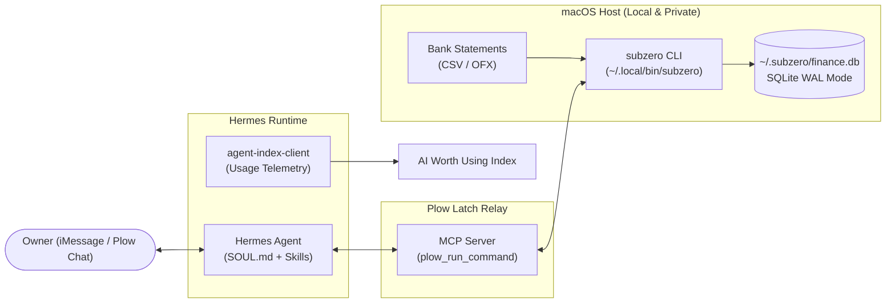

<div align="center">


# SubZero

**Local-first financial audit daemon and subscription butler for Hermes Agent.**  
Audits recurring subscriptions, flags stealth price increases, catches duplicate charges, and manages personal cash flow locally via Plow Latch.

[](https://github.com/ispectr3/subzero-agent/actions)


</div>

---

## Overview

SubZero is an autonomous financial butler built for the **Hermes Hackathon** (*AI Worth Using* × *Plow* × *Tom Preston-Werner*).

Most financial tracking applications suffer from a privacy paradox: they require users to upload bank logins, transaction records, and tax identifiers to third-party cloud aggregators.

SubZero reverses this paradigm:
- **Zero Cloud Exfiltration:** All raw bank statements, transaction logs, and balances reside exclusively on the owner's macOS host in a local SQLite database (`~/.subzero/finance.db`).
- **Sandboxed MCP Execution:** The Hermes cloud agent interacts with the user's Mac over the **Plow Latch MCP relay** via `plow_run_command`, receiving only high-level analytical summaries.
- **Conversational Channel:** Runs natively in iMessage, SMS, and Plow Chat threads.

---

## System Architecture



### Local-First vs. Cloud Aggregators

| Characteristic | Cloud Aggregators (Plaid, Mint, Rocket) | SubZero + Hermes Latch |
|---|---|---|
| **Data Residency** | Third-party cloud servers | Local host (`~/.subzero/finance.db`) |
| **Authentication** | Bank credentials / OAuth tokens stored remotely | None required; imports raw CSV / OFX directly |
| **Cadence Detection** | Static calendar heuristics | Statistical delta analysis (7d, 30d, 365d) |
| **Price Hike Tracking** | Rare / delayed | Immediate month-over-month delta alerts |
| **Runtime Footprint** | Proprietary closed SaaS | Standard library Python 3 (zero heavy deps) |

---

## Terminal Output

Running `subzero audit` produces concise, scannable summaries formatted for terminal and mobile messaging:

```text
💳 SubZero — Auditoria de Assinaturas & Recorrências
══════════════════════════════════════════════════
🔎 8 serviço(s) recorrente(s) identificado(s):

 • ChatGPT Plus / OpenAI: R$ 115.00/mês
 • Claude Pro / Anthropic: R$ 115.00/mês
 • Apple iCloud / Services: R$ 14.90/mês
 • Academia / Fitness: R$ 129.90/mês
 • Spotify: R$ 34.90/mês
 • GitHub Copilot / Sub: R$ 55.00/mês
 • Netflix: R$ 65.90/mês ⚠️ (aumentou 18%!)
 • Amazon Prime: R$ 19.90/mês

──────────────────────────────────────────────────
💸 Sangramento Recorrente: R$ 550.50/mês
📈 Impacto Projetado:     R$ 6606.00/ano
──────────────────────────────────────────────────

🚨 Alertas de Cobrança Duplicada Detectados:
 • Cobrança potencialmente duplicada: 2x R$ 142.50 em 'PÃO DE AÇÚCAR LOJA 14' entre 2026-08-14 e 2026-08-14.

📈 Alertas de Aumento de Preço:
 • Assinatura 'Netflix' aumentou de R$ 55.90 para R$ 65.90 (+17.9%).
```

---

## Quickstart

### 1. Installation
Clone the repository and run the setup script:

```bash
git clone https://github.com/ispectr3/subzero-agent.git
cd subzero-agent
./install.sh
```

`install.sh` links the executable to `~/.local/bin/subzero`, configures `~/.subzero/`, and populates a realistic seed dataset for immediate verification.

### 2. Basic Usage
The CLI is globally available from any directory:

```bash
# Audit active subscriptions, price hikes, and duplicate charges
subzero audit

# Get monthly cash flow breakdown (income, expenses, net)
subzero summary --month 2026-08

# Import bank statements (CSV or OFX standard)
subzero import-statement --file samples/nubank_exemplo.csv
subzero import-statement --file samples/itau_exemplo.ofx

# Retrieve official government unclaimed funds recovery instructions
subzero found-money --country BR
```

All commands accept `--json` for machine consumption.

---

## CLI Reference

| Command | Arguments | Description |
|---|---|---|
| `audit` | `[--db PATH] [--json]` | Runs subscription cadence matching, price hike detection, and duplicate charge checks. |
| `summary` | `[--month YYYY-MM] [--json]` | Computes total income, expenses, net balance, and spending breakdown by category. |
| `import-statement`| `--file PATH` | Auto-detects and ingests Nubank, Itaú, Inter, generic CSVs, or bank OFX files. |
| `add-tx` | `--amount N --description STR [--category STR] [--date YYYY-MM-DD]` | Records a manual transaction directly into local SQLite. |
| `found-money` | `[--country BR\|US] [--json]` | Returns official verification steps for BCB (SVR) and US State Treasuries (NAUPA). |

---

## Repository Structure

```text
subzero-agent/
├── .github/workflows/ci.yml # Automated CI matrix (Python 3.10-3.13 on macOS)
├── assets/
│   └── agent-icon.png       # 512x512 PNG app icon for Plow UI
├── engine/                  # Core local financial analysis engine
│   ├── anomaly.py           # Duplicate detection & unclaimed funds router
│   ├── database.py          # SQLite connection manager with WAL mode
│   ├── detector.py          # Subscription regex normalization & cadence logic
│   ├── importer.py          # CSV/OFX statement parser with dialect sniffing
│   ├── models.py            # Typed dataclasses
│   └── repository.py        # Aggregate queries & CRUD operations
├── runtime/
│   ├── SOUL.md              # Hermes agent identity, boundaries, and formatting rules
│   └── config.yaml          # Hermes MCP servers & chat plugin configuration
├── samples/                 # Sample statement files for testing
│   ├── itau_exemplo.ofx     # Valid bank-standard OFX SGML
│   └── nubank_exemplo.csv   # Valid credit card / account CSV
├── scripts/
│   ├── agent_index_client.py# Official AI Worth Using usage telemetry client
│   ├── seed_demo.py         # Deterministic demo dataset generator
│   └── subzero_cli.py       # Local CLI entrypoint
├── skills/
│   └── subzero/SKILL.md     # Hermes skill definition and Latch execution rules
├── tests/
│   ├── test_contract.py     # Plow Latch manifest & security invariant tests
│   └── test_detector.py     # Unit tests for cadence & anomaly algorithms
├── compose.yml              # Local container execution definition
├── install.sh               # Host setup script for macOS
├── plow-agent.json          # Official Plow agent manifest
└── pyproject.toml           # Standard Python package specification
```

---

## Development & Verification

Run the test suite:

```bash
python3 -m unittest discover tests -v
```

The test suite validates:
1. **Manifest Integrity:** Conformance with `https://plow.co/schemas/agent/v1.json`.
2. **Security Invariants:** Ensures no live API keys or Plow tokens are committed.
3. **Detection Accuracy:** Verifies subscription cadence identification and duplicate detection algorithms.
4. **Asset Constraints:** Confirms `assets/agent-icon.png` is under 512 KB and valid PNG.

---

## Hermes Deployment & Telemetry

### 1. Register on the Agent Index
```bash
python3 scripts/agent_index_client.py --register \
  --agent "subzero" \
  --name "SubZero — Financial Butler" \
  --blurb "Local-first subscription auditor and financial butler via Plow Latch."
```

### 2. Launch with Plow Agents
```bash
plow-agents mint <your-line-id>
docker compose up -d
```

---

## License

MIT License. See [LICENSE](LICENSE) for terms.
