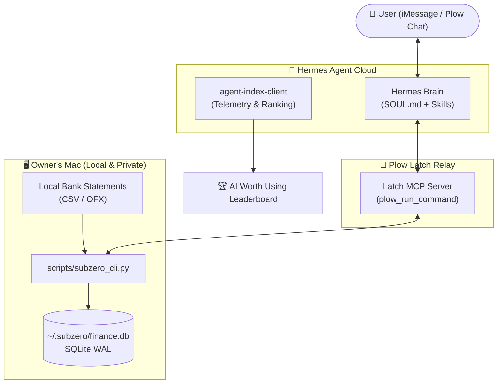

# ❄️ SubZero — Financial & Subscription Butler

> **Privacy-First Autonomous Financial Butler on Hermes Agent & Plow Latch**  
> Built for the **Hermes Hackathon** by *AI Worth Using* x *Plow* x *Tom Preston-Werner*.

<p align="center">
  
</p>

---

## 💡 The Problem: Silent Financial Leaks

Every year, modern consumers bleed thousands in untracked finances:
- **Zombie Subscriptions:** The average person spends over $219/month across 12+ subscriptions — over 30% are forgotten or rarely used.
- **Stealth Price Hikes:** Streaming, cloud, and AI tools silently raise prices by 15% to 25% without explicit push notifications.
- **Duplicate Charges:** Supermarket double-swipes and phantom recurring charges go unnoticed across long credit card bills.
- **Unclaimed / Forgotten Money:** Over R$ 8.5 billion (Banco Central do Brasil) and $15+ billion (US State Treasuries) sit forgotten in closed accounts.
- **The Cloud Privacy Dilemma:** Users hate sharing their personal bank statements, account numbers, and transaction history with closed cloud platforms.

---

## 🛡️ The Solution: SubZero

**SubZero** is an autonomous personal financial butler running on **Hermes Agent**, communicating through **iMessage / Plow Chat**, and interacting with the user's Mac via **Plow Latch MCP**.

### 🔒 100% Local Privacy Guarantee
- **Zero Cloud Exfiltration:** Your raw financial transactions, bank statements, and account balances **never leave your local machine**.
- **Local SQLite Storage:** Everything is stored securely at `~/.subzero/finance.db`.
- **Plow Latch Relay:** Hermes runs analytical queries through audited `plow_run_command` calls, receiving only synthesized summaries to format into your chat.

---

## 🏛️ Architecture



---

## ✨ Key Capabilities

| Feature | Description |
|---|---|
| 🔄 **Subscription Audit** | Automatically discovers recurring cadences (weekly, monthly, yearly) and calculates annual financial drag. |
| 📈 **Price Hike Detection** | Identifies subtle month-over-month price bumps (e.g. Netflix increasing from R$ 55.90 to R$ 65.90). |
| 🚨 **Duplicate Charge Buster** | Catches double charges on the same day or within 48h windows at identical merchants. |
| 💰 **Found Money Navigator** | Step-by-step guidance to claim official forgotten funds via Banco Central (SVR) & US Treasuries. |
| 📊 **Monthly Cash Flow** | Clean, visual breakdown of income, expenses, and net surplus/deficit per category. |
| 📑 **Universal Importer** | Supports Nubank, Itaú, Inter, Bradesco, generic CSVs, and bank-standard OFX files. |

---

## 🚀 Quickstart & Local Demo

### 1. Clone & Setup
```bash
git clone https://github.com/ispectr3/subzero-agent.git
cd subzero-agent
```

### 2. Seed Realistic Demo Data
Populate your local test SQLite database with realistic transactions (salaries, subscriptions, Netflix price hike, and duplicate grocery charge):
```bash
python3 scripts/seed_demo.py
```

### 3. Run Local Audits
```bash
# 1. Full Subscription & Anomaly Audit
python3 scripts/subzero_cli.py audit

# 2. Monthly Summary
python3 scripts/subzero_cli.py summary --month 2026-08

# 3. Found Money Guide (Brazil or US)
python3 scripts/subzero_cli.py found-money --country BR
```

### 4. Run Test Suite
```bash
python3 -m unittest discover tests
```

---

## 💬 Chat Interaction Examples (iMessage / Plow Chat)

### 💬 "Quais minhas assinaturas ativas?"
> **SubZero:**
> 💳 **SubZero — Auditoria de Assinaturas**
> 
> 🔎 **8 serviços recorrentes identificados:**
> • 🤖 **ChatGPT Plus:** R$ 115.00/mês (R$ 1.380/ano)  
> • 🧠 **Claude Pro:** R$ 115.00/mês (R$ 1.380/ano)  
> • 🏋️ **Academia:** R$ 129.90/mês (R$ 1.558/ano)  
> • 🎬 **Netflix:** R$ 65.90/mês ⚠️ *(aumentou 18%! Era R$ 55.90)*  
> • 💻 **GitHub Copilot:** R$ 55.00/mês (R$ 660/ano)  
> • 🎵 **Spotify:** R$ 34.90/mês (R$ 418/ano)  
> • 📦 **Amazon Prime:** R$ 19.90/mês (R$ 238/ano)  
> • ☁️ **Apple iCloud:** R$ 14.90/mês (R$ 178/ano)  
> 
> 💸 **Sangramento Mensal:** R$ 550.50/mês  
> 📈 **Impacto Anual:** R$ 6.606.00/ano  
> 
> 💡 *Cancelando Netflix e um dos assistentes de IA, você economiza R$ 2.170,00 por ano.*

---

### 💬 "Teve alguma cobrança estranha ou duplicada?"
> **SubZero:**
> 🚨 **Cobrança Duplicada Detectada:**  
> • **Estabelecimento:** Pão de Açúcar Loja 14  
> • **Valor:** 2x R$ 142.50 no dia 14/08/2026.  
> • **Recomendação:** Verifique sua fatura ou cupom fiscal e solicite o estorno do valor duplicado com a operadora do cartão.

---

### 💬 "Como resgato dinheiro esquecido?"
> **SubZero:**
> 💰 **Valores a Receber — Banco Central do Brasil (SVR)**  
> 🏛️ **Portal Oficial:** [valoresareceber.bcb.gov.br](https://valoresareceber.bcb.gov.br)  
> 
> 1. Acesse o portal oficial e entre com sua conta `Gov.br` (prata ou ouro).  
> 2. Consulte se há valores a receber em contas antigas, consórcios ou tarifas indevidas.  
> 3. Solicite o resgate via chave Pix diretamente para sua conta bancária.  
> ⚠️ *Atenção: O Banco Central nunca envia links por SMS, WhatsApp ou e-mail!*

---

## 🏆 Deployment & Hackathon Leaderboard

SubZero integrates the official `agent-index-client.py` to report installs and tokens to the AI Worth Using Leaderboard.

### 1. Register SubZero on the Agent Index
```bash
python3 scripts/agent_index_client.py --register \
  --agent "subzero" \
  --name "SubZero — Financial & Subscription Butler" \
  --blurb "Privacy-first personal financial butler. Audits subscriptions, catches price hikes and duplicate charges locally via Plow Latch."
```

### 2. Deploy with `plow-agents`
```bash
# Mint credentials for your Plow line
plow-agents mint <your-line-id>

# Start SubZero
docker compose up -d
```

---

## 📄 License

Apache-2.0. Built with pride for the **Hermes Hackathon 2026**.
